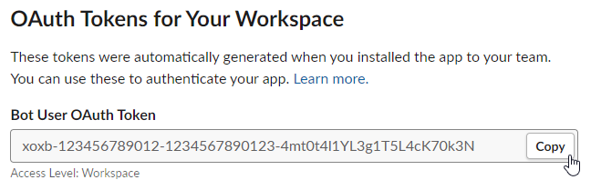

# Slack Guides

Guides for setting up the [Slack](../../services/slack.md) service

## Getting a token

To enable all features, either the Legacy Webhook- (deprecated and might stop working) or the bot API tokens needs to
be used. Only use the non-legacy Webhook if you don't need to customize the bot name or icon.

### Bot API (preferred)

1. Create a new App for your bot using the [Basic app setup guide](https://api.slack.com/authentication/basics)
2. Install the App into your workspace ([slack docs](https://api.slack.com/authentication/basics#installing)).
3. From [Apps](https://api.slack.com/apps), select your new App and go to **Oauth & Permissions**
   <figure></figure>
4. Copy the Bot User OAuth Token
   <figure></figure>
   
!!! example
    Given the API token
    <pre><code><b>xoxb</b>-<b>123456789012</b>-<b>1234567890123</b>-<b>4mt0t4l1YL3g1T5L4cK70k3N</b></code></pre>
    and the channel ID `C001CH4NN3L` (obtained by using the [guide below](#getting_the_channel_id)), the Shoutrrr URL
    should look like this:
    <pre><code>slack://<b>xoxb</b>:<b>123456789012</b>-<b>1234567890123</b>-<b>4mt0t4l1YL3g1T5L4cK70k3N</b>@<b>C001CH4NN3L</b></code></pre>

### Webhook tokens

Get a Webhook URL using the legacy [WebHooks Integration](https://slack.com/apps/new/A0F7XDUAZ-incoming-webhooks), 
or by using the [Getting started with Incoming Webhooks](https://api.slack.com/messaging/webhooks#getting_started) guide and
replace the initial `https://hooks.slack.com/services/` part of the webhook URL with `slack://hook:` to get your Shoutrrr URL.

!!! info "Slack Webhook URL"
    <code>https://hooks.slack.com/services/<b>T00000000</b>/<b>B00000000</b>/<b>XXXXXXXXXXXXXXXXXXXXXXXX</b></code>

!!! info "Shoutrrr URL"
    <code>slack://hook:<b>T00000000</b>-<b>B00000000</b>-<b>XXXXXXXXXXXXXXXXXXXXXXXX</b>@webhook</code>

## Getting the Channel ID

!!! note ""
    Only needed for API token. Use `webhook` as the channel for webhook tokens.

1. In the channel you wish to post to, open **Channel Details** by clicking on the channel title.
   <figure></figure>

2. Copy the Channel ID from the bottom of the popup and append it to your Shoutrrr URL
   <figure></figure>