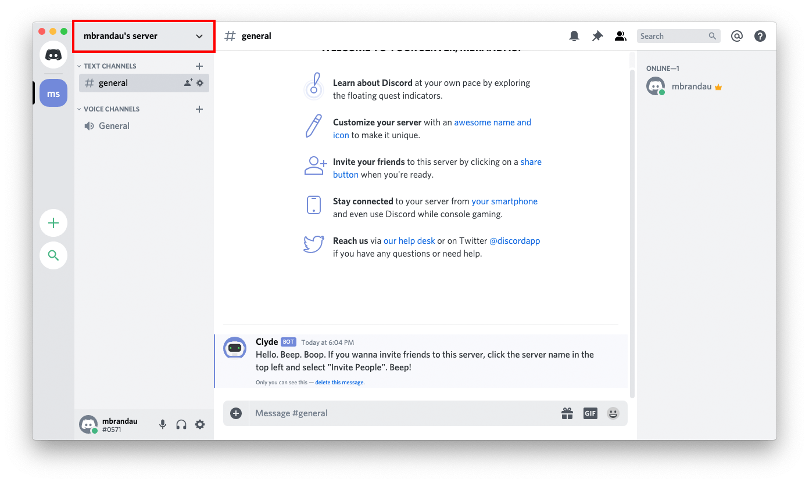
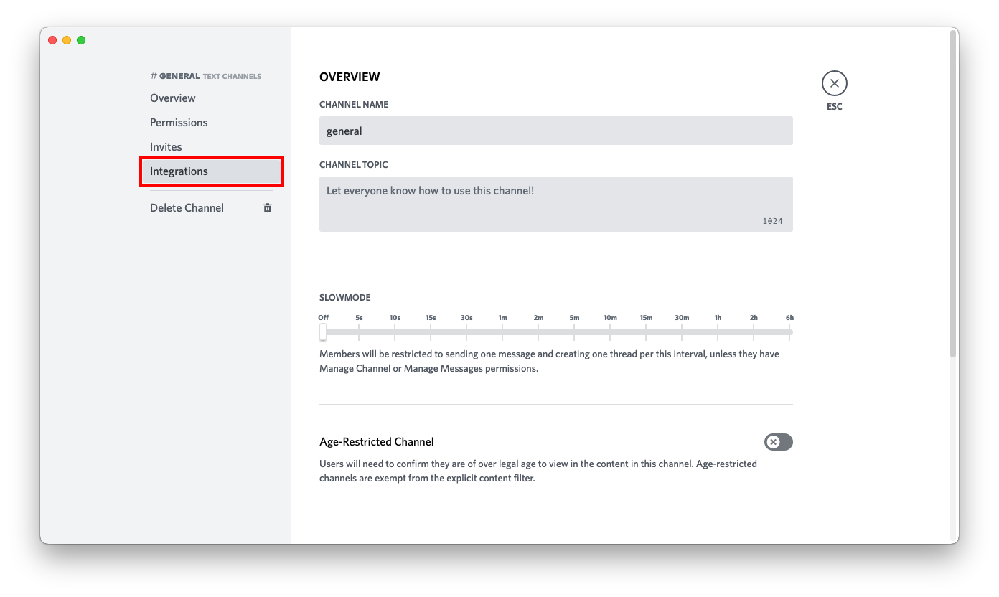
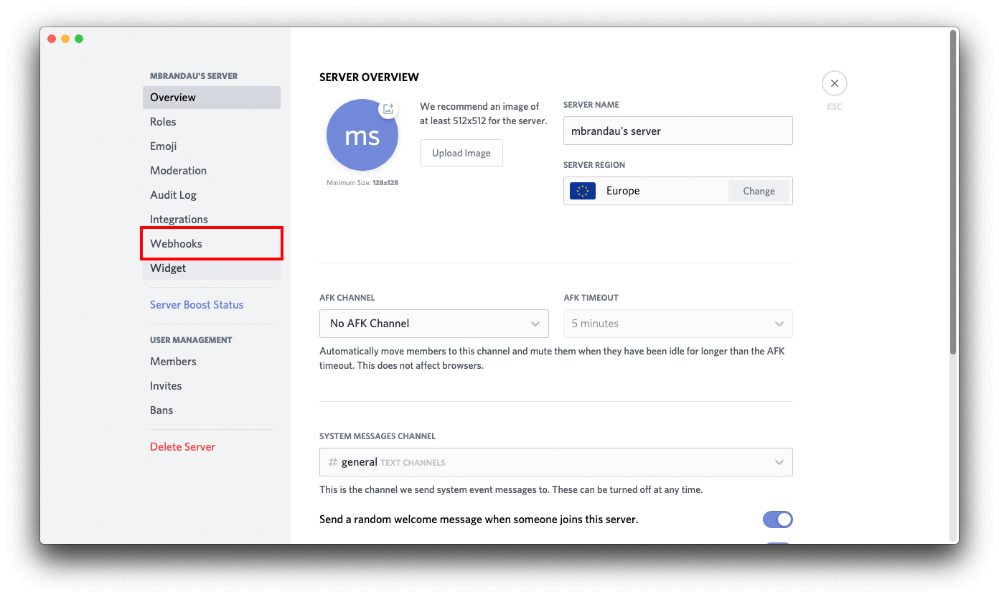
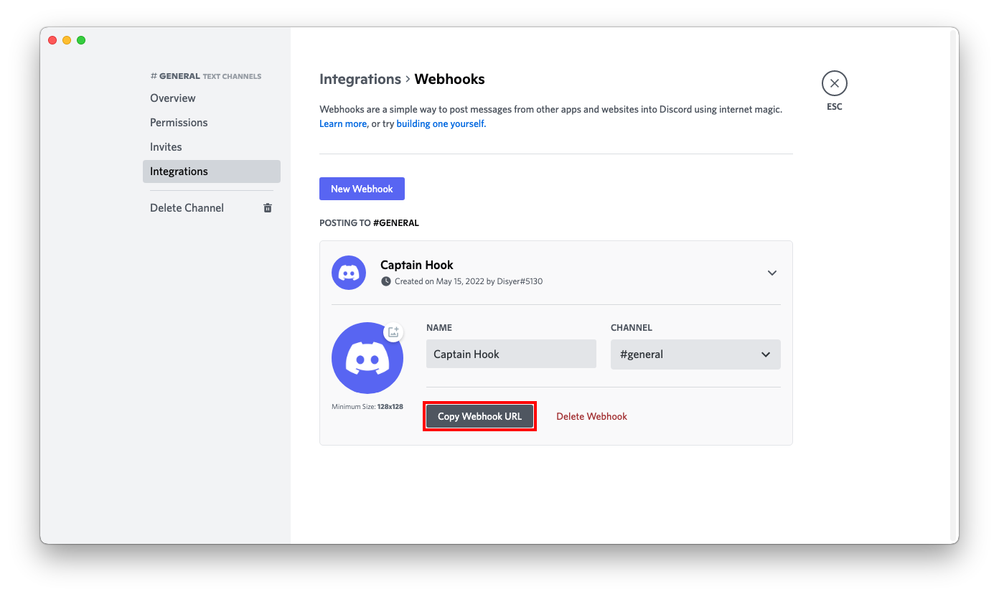
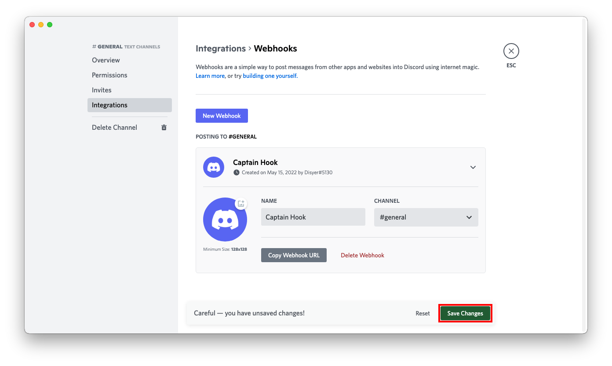

# Discord

## URL Format

Your Discord Webhook-URL will look like this:
> https://discordapp.com/api/webhooks/__`channel`__/__`token`__  

The shoutrrr service URL should look like this:  
> discord://__`token`__@__`channel`__

## Creating a webhook in Discord

1. Open your server settings by first clicking on the name of the server.


2. Then click on *Server Settings*.


3. In the menu on the left, click on *Webhooks*.


4. In the top right corner, click on *Create Webhook*.


5. Set name, channel and icon to your liking and copy the *Webhook URL* on the bottom. Then click save.


6. Format the service URL
```
https://discordapp.com/api/webhooks/693853386302554172/W3dE2OZz4C13_4z_uHfDOoC7BqTW288s-z1ykqI0iJnY_HjRqMGO8Sc7YDqvf_KVKjhJ
                                    └────────────────┘ └──────────────────────────────────────────────────────────────────┘
                                        webhook id                                    token

discord://W3dE2OZz4C13_4z_uHfDOoC7BqTW288s-z1ykqI0iJnY_HjRqMGO8Sc7YDqvf_KVKjhJ@693853386302554172
          └──────────────────────────────────────────────────────────────────┘ └────────────────┘
                                          token                                    webhook id
```
