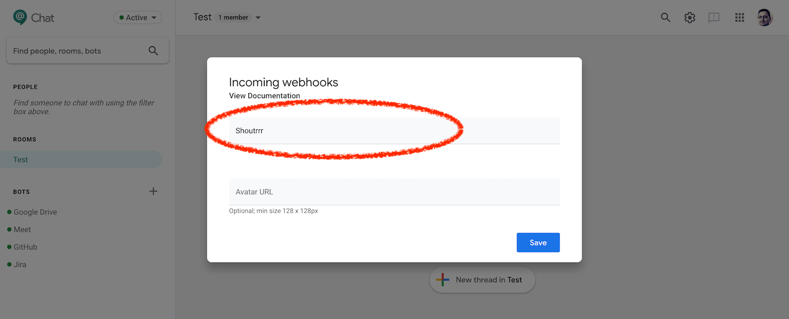

# Google Chat

## URL Format

Your Google Chat Incoming Webhook URL will look like this:

!!! info ""
    https://chat.googleapis.com/v1/spaces/__`FOO`__/messages?key=__`bar`__&token=__`baz`__

The shoutrrr service URL should look like this:

!!! info ""
    googlechat://chat.googleapis.com/v1/spaces/__`FOO`__/messages?key=__`bar`__&token=__`baz`__

In other words the incoming webhook URL with `https` replaced by `googlechat`.

Google Chat was previously known as Hangouts Chat. Using `hangouts` in
the service URL instead `googlechat` is still supported, although
deprecated.

## Creating an incoming webhook in Google Chat

1. Open the room you would like to add Shoutrrr to and open the chat
room menu.

2. Then click on *Configure webhooks*.

3. Name the webhook and save.

4. Copy the URL.

5. Format the service URL by replacing `https` with `googlechat`.
