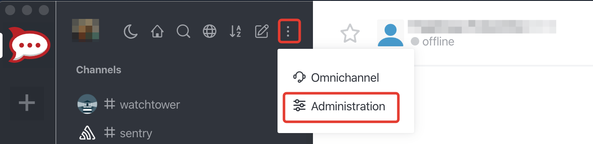
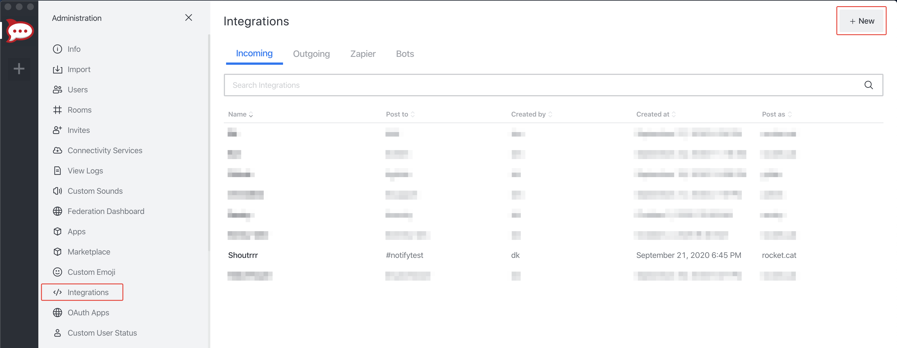
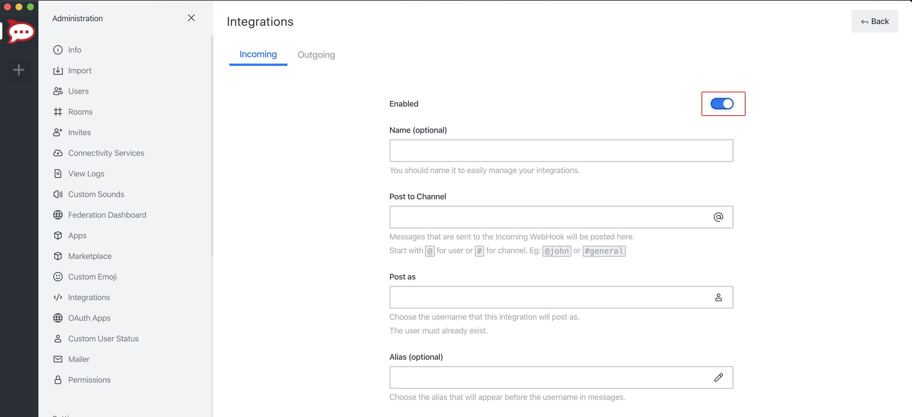
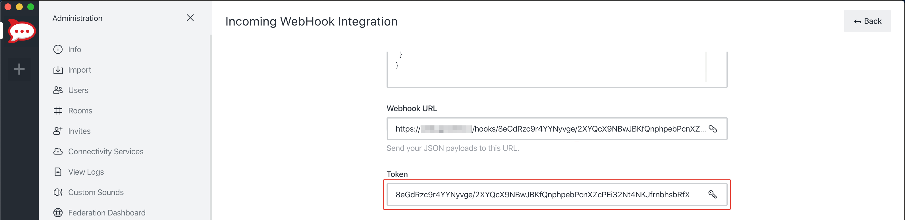

# Rocket.chat

## URL Format
*rocketchat://[__`username`__@]__`rocketchat-host`__/__`token`__[/__`channel`&#124;`@recipient`__]* 


## Creating a Webhook in Rocket.chat

1. Open up the chat Administration by clicking on *Administration* menu


2. Open *Integrations* and then click *New*


3. Fill in the information for the webhook and click *Save*. Please don't forget to Enable your integration. 


5. If you did everything correctly, Rocket.chat will give you the *URL* and *Token* to your newly created webhook.


6. Format the service URL
```
rocketchat://your-domain.com/8eGdRzc9r4YYNyvge/2XYQcX9NBwJBKfQnphpebPcnXZcPEi32Nt4NKJfrnbhsbRfX
                             └────────────────────────────────────────────────────────────────┘
                                                           token
```

## Additional URL configuration

Rocket.chat provides functionality to post as another user or to another channel / user, compared to the webhook configuration.
<br/>
To do this, you can add a *sender* and/or *channel* / *receiver* to the service URL.

```
rocketchat://shoutrrrUser@your-domain.com/8eGdRzc9r4YYNyvge/2XYQcX9NBwJBKfQnphpebPcnXZcPEi32Nt4NKJfrnbhsbRfX/shoutrrrChannel
             └──────────┘                 └────────────────────────────────────────────────────────────────┘ └─────────────┘
                sender                                                   token                                   channel

rocketchat://shoutrrrUser@your-domain.com/8eGdRzc9r4YYNyvge/2XYQcX9NBwJBKfQnphpebPcnXZcPEi32Nt4NKJfrnbhsbRfX/@shoutrrrReceiver
             └──────────┘                 └────────────────────────────────────────────────────────────────┘ └───────────────┘
                sender                                                   token                                    receiver
```

## Passing parameters via code

If you want to, you also have the possibility to pass parameters to the `send` function.
<br/>
The following example contains all parameters that are currently supported.

```gotemplate
params := (*types.Params)(
	&map[string]string{
		"username": "overwriteUserName",
		"channel": "overwriteChannel",
	},
)

service.Send("this is a message", params)
```

This will overwrite any options, that you passed via URL.

For more Rocket.chat Webhooks options see [official guide](https://docs.rocket.chat/guides/administrator-guides/integrations).
